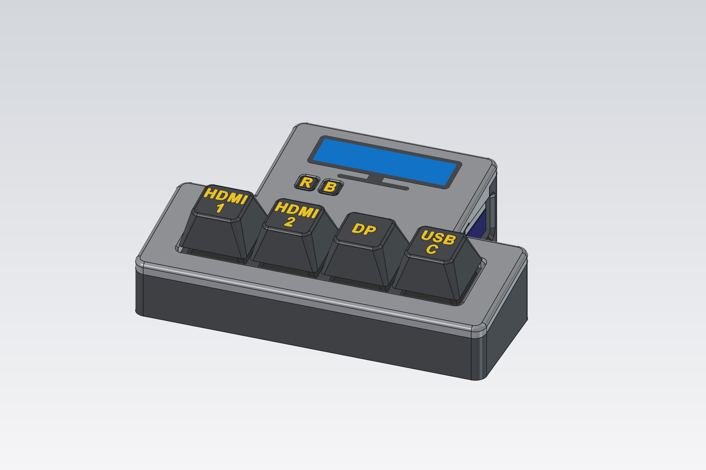
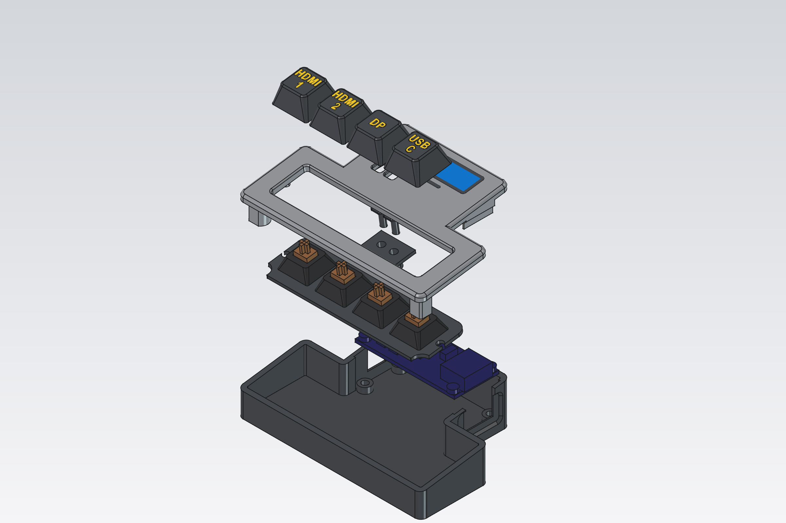

# HDMI-DDC Input Switch

A small desk box with mechanical keys that switches your monitor's input in one press.
It plugs into a spare HDMI port on the monitor and sends the monitor's own "change input"
command over DDC/CI, so it works with whatever is on the other inputs: a PC on
DisplayPort, a laptop on USB-C, a console on HDMI. Nothing to install on any computer.

**Project page: <https://jeyeager65.github.io/hdmi-ddc-input-switch/>**: build guide,
configurator and firmware installer.



- **[Adafruit Feather RP2040 DVI](https://www.adafruit.com/product/5710)** inside; keys are
  standard MX switches (built with [Kailh Tactile Brown](https://www.adafruit.com/product/4954)).
- **Any DDC/CI monitor** via presets. Includes LG UltraGear, which needs LG's
  proprietary command (tested on the 45GR75DC-B), and the standard MCCS command.
- **Info screen:** pressing the key for the switch's own HDMI port shows the current
  setup on the monitor.
- **Set up in the browser:** a web page (Chrome/Edge, Web Serial) installs firmware
  and configures the keys. Settings live on the switch.
- **3D-printed case** designed to print without supports, with multi-colour inlays.

## Build it

Everything for building and using it is on the
[project page](https://jeyeager65.github.io/hdmi-ddc-input-switch/): **parts list, print
files, wiring, assembly, monitor setup, configuration, firmware install and
troubleshooting**. You can also run the page locally (below). Firmware is attached to
each [release](https://github.com/jeyeager65/hdmi-ddc-input-switch/releases) too.



## Repository layout

| Path | What |
|---|---|
| `src/` | Firmware (Arduino, earlephilhower RP2040 core): `config` (flash settings), `ddc` (DDC/CI), `buttons`, `protocol` (JSON over USB serial), `screen` (PicoDVI info screen), `app` |
| `web/` | The project page: guide, configurator and installer (`index.html`), monitor presets (`presets.json`), images |
| `case/` | Parametric FreeCAD scripts for the case (`case.py`), keycaps (`keycaps.py`), test prints (`coupon.py`), assembly preview (`assembly.py`), build-step scenes (`steps.py`), GUI preview colours (`show.py`), guide pictures (`render.py`) |
| `case/export/` | Print-ready STL / 3MF files |
| `tools/version.py` | Stamps the firmware version from the git tag |
| `.github/workflows/firmware.yml` | CI: build; on tags, release + publish the page |
| `PLAN.md` | Design decisions, protocol, progress and test checklist |

## Firmware

Built with [PlatformIO](https://platformio.org/). The platform, core and libraries are
pinned in `platformio.ini`.

```sh
pio run -e feather_dvi          # build → .pio/build/feather_dvi/firmware.uf2
```

To flash, put the board in install mode (hold BOOT, tap RESET, or use the page's
Install tab) and copy `firmware.uf2` to the `RPI-RP2` drive. On Windows, `pio run -t
upload` needs a Zadig driver for picotool; copying the file doesn't.

Serial at 115200: one JSON object per line (`{"cmd":"version|get|set|save|send|raw|scan|reset|reboot|bootloader"}`),
plus `1`–`8` / `s` / `?` shortcuts for bench testing. See `src/protocol.h` and `PLAN.md`.

## Web page, locally

Web Serial needs https or `localhost`:

```sh
cp .pio/build/feather_dvi/firmware.uf2 web/      # optional: for the Install tab
mkdir -p web/print && cp case/export/*.{stl,3mf} web/print/   # optional: guide downloads
python -m http.server 8000 -d web                # then open http://localhost:8000
```

## Case

The case is generated by Python scripts run inside FreeCAD 1.x, all dimensions as
parameters at the top of each file. Headless:

```sh
freecadcmd case/case.py        # tray, lid (+ inlays), switch plate, R/B buttons → case/export/
freecadcmd case/keycaps.py     # keycaps + stem-fit test
freecadcmd case/assembly.py    # assembly and exploded preview → case/build/
freecadcmd case/steps.py       # build-step scenes → case/build/
```

Then, in the FreeCAD GUI's Python console, `case/render.py` renders the README and guide
pictures into `web/images/`.

Board geometry comes from Adafruit's published PCB files; connector heights were
measured. The scripts check for collisions and overhangs as they go.

Things you may want to change (top of each file):

- `case.py`: `USB_PLUG` / `HDMI_PLUG`, your cables' plug housing sizes (they set the
  port recesses and the case height); `NUM_KEYS`; `TILT_DEG`; `LID_ART`.
- `keycaps.py`: `LEGENDS`, the text on each key, left to right (`
` for two lines).
- Print settings that the geometry assumes: 0.2 mm layers (inlays are 0.6 mm deep;
  `SACRIFICIAL_LAYER` bridges the screw holes), 0.4 mm nozzle.

## Adding a monitor

Find your monitor's values with the configurator's **Try** button, then add an entry to
`web/presets.json`:

```json
{ "id": "brand-model", "name": "Brand Model", "vcp": 96, "src": 81,
  "inputs": [{ "name": "DP", "value": 15 }, { "name": "HDMI 1", "value": 17 }],
  "notes": "What you tested it on." }
```

`vcp`/`src` are the input-select VCP code and DDC/CI source address (standard: `0x60`
from `0x51`). Pull requests welcome.

## Releases

Pushing a tag like `v1.0.0` builds the firmware, attaches it to a GitHub Release, and
publishes the project page (with that firmware and the print files) to GitHub Pages.
One-time setup: **Settings → Pages → Source: GitHub Actions**.

## License

MIT, see [LICENSE](LICENSE). That covers the firmware, the web page and the case and
keycap designs.
